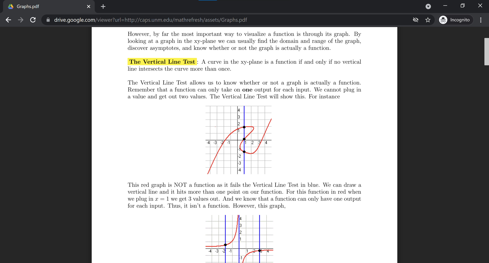

+++
title = "Google Drive Preview"
overview = "Shared component supporting quick display of user-provided content in Google Drive, Gmail, and several other Google products."
+++

I was the Technical Lead on Google Drive Preview, a shared component handling the display of user-uploaded documents in Google Drive, GMail, and several other Google products.
Upon inheriting a legacy codebase from previous contributors, I worked to deliver key features while reducing technical debt and supporting junior members of the team.

<!--more-->

Engineering options available to Preview were constrained from above and below - we relied on services from other Google organizations such as Youtube and Google Photos for the display of certain filetypes, but also supported integrations with several products including Drive, Gmail, and even critical internal applications used by the legal and hiring teams.
Despite these challenges, under my leadership the team delivered several key changes enabling Drive features including [embedded commenting](https://www.blog.google/products/g-suite/new-ways-comment-microsoft-files-and-more-google-drive), [shortcuts](https://workspaceupdates.googleblog.com/2020/03/shortcuts-for-google-drive.html), [enterprise approvals](https://workspaceupdates.googleblog.com/2019/07/drive-approvals-beta.html), and [enterprise metadata](https://workspaceupdates.googleblog.com/2021/06/drive-labels-automated-classification-dlp-betas.html).
At the same time we tackled several points of technical debt including reductions in build time, improvements in automated testing reliability, and enabling static analyzers that completely eliminated null reference errors in production.

# Resources

* [Google Drive](https://google.com/drive)