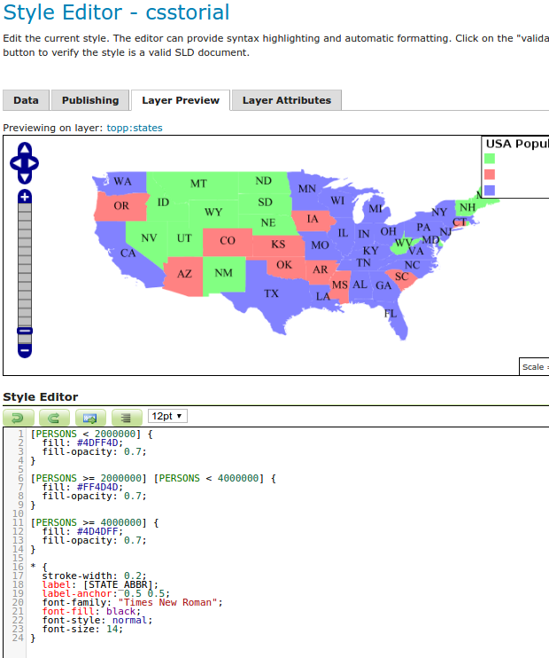

+++
title = "GeoServer CSS"
overview = "Data-driven map rendering made accessible to web developers."
weight = 1
+++

I designed and implemented an adaptation of the CSS browser standard for geospatial data.
While other projects exploring this idea exist (eg. [Cascadenik](https://github.com/mapnik/Cascadenik), [CartoCSS](https://carto.com/developers/styling/cartocss/)), mine integrated with GeoTools, making it a convenient option for operators of the GeoServer map tile server.
I further encouraged adoption by building a UI for GeoServer with live-updating preview as styles are edited and engaging with the community via online forums (IRC, mailing list) and conference presentations.

<!--more-->

CSS came as an alternative to the OGC standardized Styled Layer Descriptor language, an XML dialect for specifying map rendering.
The validity requirements and deeply nested structure of SLD XML made it a poor fit for direct editing, essentially requiring the use of graphical editors to compose maps.
GeoServer did not provide such a graphical editor, so the CSS extension made for a much tighter feedback loop when iterating on style decisions.

On the technical side, the CSS extension was one of the first GeoServer extensions to rely on a JVM-compatible language other than Java.
By relying on Scala the project was able to take advantage of parser support in the standard library while also enjoying good compatibility with generics and other Java language features used in the GeoServer extension API.

# Resources

[CSS Styling](https://docs.geoserver.org/stable/en/user/styling/css/index.html) in the GeoServer user manual.