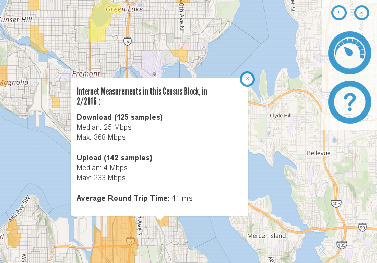

+++
title = "Piecewise"
overview = "Reusable template for data sites highlighting subsets of a global database of internet measurements."
weight = 1
+++

I worked with the Open Technology Institute at the New America Foundation to create Piecewise, a system for creating data sites focusing on subsets of the Internet Measurement Lab test results set.
The Measurement Lab has collected packet-level network test results from around the world since 2009, and that volume of data presents some challenges to interactivity in visualization.
By focusing on clear, regional data stories such as Seattle's broadband initiative, I was able to use precomputation to achieve reliable responsivity.

<!--more-->

I designed a solution centered around a schema for configuration files that specify filtering and aggregation criteria (such as geographic extent, time/date range, and test metrics) relative to the raw Measurement Lab data.  I provided three software artifacts to consume this configuration to provide location-specific data sites:
* A batch ingest tool to query the public BigQuery tables hosted by the Measurement Lab team.
  This step filters out irrelevant data and precomputes aggregate statistics, greatly reducing the size of the working data set.
  The working data is stored in a database table managed by Measurement Lab partners such as Seattle, independent of Measurement Lab infrastructure.
* A simple web API that serves aggregate statistics from the working data.
* A web-browser based user interface for exploring the statistics via interactive charts and maps.

Along with the software artifacts mentioned above, I provided OTI staff with documentation on maintaining and extending the software and supported the configuration and deployment for Seattle.  The Piecewise software continues to grow and adapt to needs of OTI and its partners.

## References
[More Than the Beginning of a Beautiful Friendship](https://context.newamerica.org/more-than-the-beginning-of-a-beautiful-friendship-12a1094fb30d)

[m-lab/piecewise on Github](https://github.com/m-lab/piecewise)

[m-lab/piecewise-saas on Github](https://github.com/m-lab/piecewise-saas)