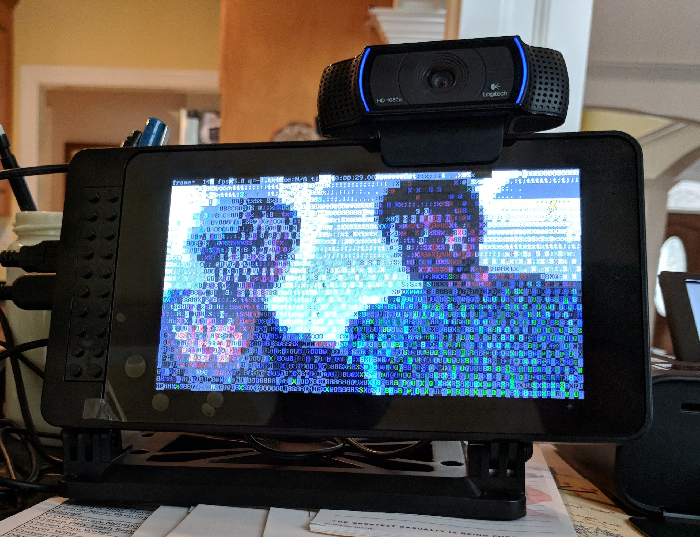

+++
title = "Rocketbooth"
+++

# Rocketbooth

For my wedding I made a self-service photobooth out of a Raspberry Pi and some off-the-shelf peripherals.
It was very successful and I found friends and family asking me to run a photobooth at other events afterwards.
The code is available on Github at [dwins/rocketbooth](https://github.com/dwins/rocketbooth).

Before starting from scratch I reviewed existing solutions.
There are some open source photobooth controllers out there for Raspberry Pi.
Generally however the solutions I found didn't work quite the way I wanted; my vision was a photobooth that would take multiple photos on a timer and be somewhat resistant to misuse by confused or tipsy wedding guests, and generally the solutions I found would take a single photo, not use a timer, or run in a window that could easily be closed.

As a personal project I took this opportunity to explore the Rust programming language, building on the [image](https://crates.io/crates/image) crate for saving images and developing my own bindings to ffmpeg, opengl es, and cups for interacting with the camera,  display, and printer.
Ultimately I was able to offer the experience I had initially envisioned within the performance budget of the Rasbperry Pi.

## References

[dwins/rocketbooth on Github](https://github.com/dwins/rocketbooth)

[Presentation](rocketbooth-boston-rust.pdf) made to the Boston Rust Meetup about this project.