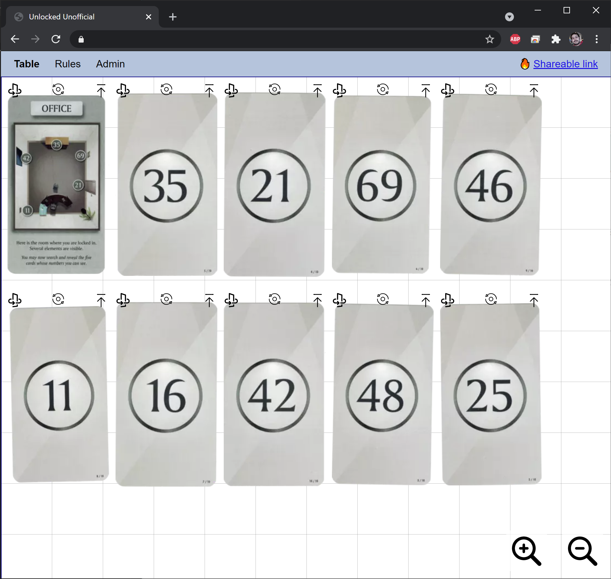

+++
title = "Unlocked Unofficial"
+++

# Unlocked Unofficial

> Digital tabletop for puzzle card games

During the global lockdown in response to the COVID-19 pandemic, I found myself playing more casual multiplayer games online.
While there are many options out there for playing tabletop games online, I'm not aware of a solution that would work for the Unlock! series of games.
These games are distributed as a deck of cards, but are played as puzzles relying on a smartphone app and the players' ability to flip and rotate the cards physically.
I created a web app to allow friends to share a virtual tabletop with all players able to move cards and see positions update in real time.

The user flow for playing the game is fairly straightforward: one player creates a session by choosing one of the available scenarios, and the app generates a sharable link that can be used to invite other players.
Once invited, all participants can freely rotate and reposition cards.
Rather than modeling the game rules in the app, I assume that the companion app will be shared somehow (e.g. Google Meet's Android app) and used to determine which cards may be revealed.
To support this while avoiding giving every player the ability to spoil the game, the initiator of a session has a special Admin tab that allows revealing cards as indicated by the app.

## Technology

The frontend is implemented in [d3.js](https://d3js.org/), using the d3-zoom and d3-drag modules to facilitate navigating the table and manipulating the cards.
Each open tab maintains a websocket connection to a bespoke Rust backend for synchronization; a log of user actions is streamed to the server and the server broadcasts full state snapshots as actions are resolved.
The scenario initial state comes from a collection of static files that I created from the [free demos](https://spacecowboys.fr/unlock-demos-english) provided by the creators of Unlock!

## More information

[Unlock!](https://spacecowboys.fr/unlock)
