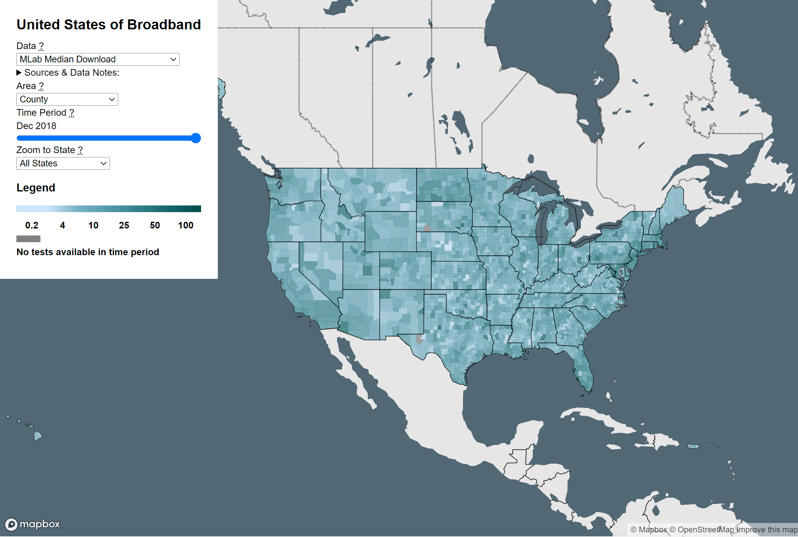

+++
title = "US Broadband Mapping"
overview = "Evaluating broadband speeds reported by service providers against real-world measurements."
weight = 2
+++

I volunteered with the Open Technology Institute to support an intern project exploring the relationship between the Federal Communication Commission's broadband map and the internet test data collected and managed by OTI's Internet Measurement Lab.  The broad goal of the project was to evaluate how well the user-volunteered data from the Measurement Lab supported providers' claims about service offerings in the FCC data.
The investigation was fully owned by the intern, and my role in the project was supporting the web deployment of an interactive map of results in a way that the OTI operations team would be able to maintain more easily going forward.

<!--more-->

The primary challenges to production support were the use of the R programming language for data analysis and visualization.  Since the operational team was already using scheduled SQL queries for other data products, I helped to rewrite the R analysis in SQL, resulting in lower maintenance overhead and faster performance (mainly attributable to reduced data transfer between systems.)  To allow the scheduled analysis to run fully in BigQuery, I ingested some geodata and provided some coaching to the general team on the use of tools such as GDAL and OGR.  We were also able to recreate and expand on the initial visualization using R/Shiny by recreating it in Mapbox GL with custom controls.

## References

[The United States of Broadband Map](https://www.newamerica.org/oti/reports/united-states-broadband-map/the-united-states-of-broadband-map/)

[opentechinstitute/UnitedStatesofBroadband](https://github.com/opentechinstitute/UnitedStatesofBroadband) on Github

[opentechinstitute/USBB](https://github.com/opentechinstitute/USBB) on Github